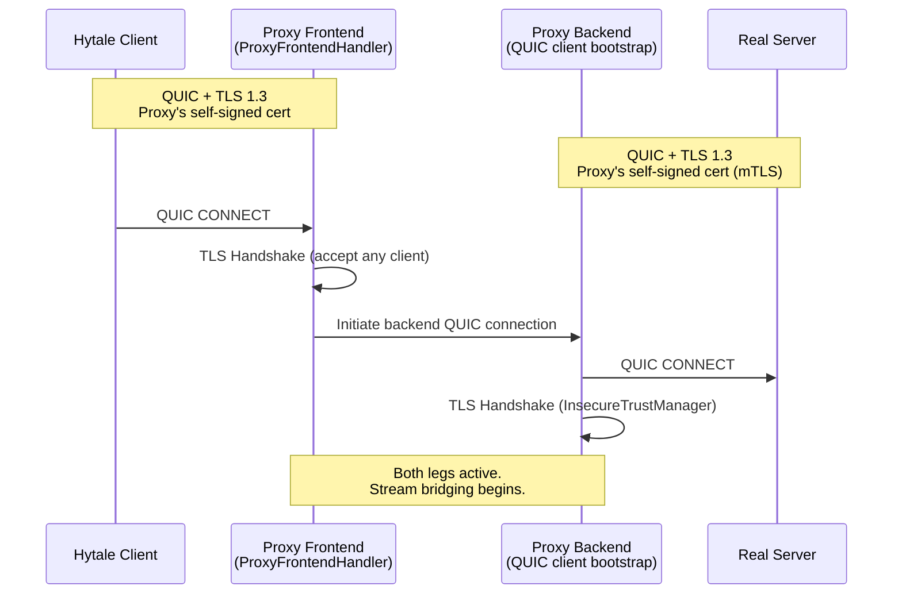
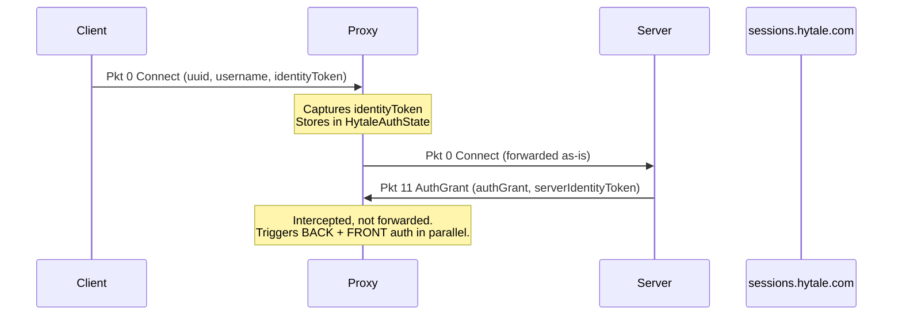
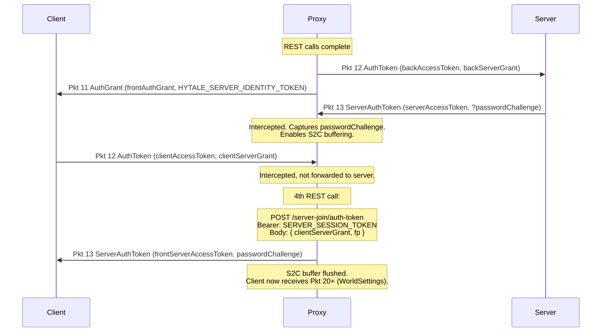

# Meridian Proxy

A transparent man-in-the-middle proxy for Hytale game traffic. Intercepts the QUIC connection between the Hytale client and a dedicated server, enabling real-time packet inspection, modification, and injection while maintaining a fully authenticated session on both sides.

---

## Quick Start

- **Download:** grab the latest build from the [Releases](../../releases) page.
- **Video guide:** [watch the setup walkthrough](https://youtu.be/O_rd1cLwxMI).
- **Connecting to a server:** in the Hytale client, create a **single-player** world and set its name to the server's IP prefixed with `~`.
    - Example: for a server at `45.12.34.56:5520`, name the world `~45.12.34.56:5520` (or `~45.12.34.56_5520`).
    - The proxy detects the `~` prefix and forwards your session to that server instead of launching a local one.

---

## Table of Contents

- [Architecture Overview](#architecture-overview)
- [Connection Topology](#connection-topology)
- [Authentication Flow](#authentication-flow)
  - [Phase 1: Initial Handshake](#phase-1-initial-handshake)
  - [Phase 2: Token Exchange](#phase-2-token-exchange)
  - [Phase 3: Session Stabilization](#phase-3-session-stabilization)
  - [Re-Authentication (Token Rotation)](#re-authentication-token-rotation)
- [Packet Protocol](#packet-protocol)
  - [Framing](#framing)
  - [Key Packet IDs](#key-packet-ids)
- [QUIC Stream Management](#quic-stream-management)
- [S2C Buffering Mechanism](#s2c-buffering-mechanism)
- [Project Structure](#project-structure)
- [Environment Variables](#environment-variables)
- [Build & Run](#build--run)
- [Troubleshooting](#troubleshooting)
- [Known Issues](#known-issues)

---

## Architecture Overview

The proxy operates as two independent QUIC endpoints sharing a common authentication state:

```
┌──────────────┐          ┌───────────────────────────────────┐          ┌──────────────┐
│              │   QUIC   │            MITM Proxy             │   QUIC   │              │
│    Hytale    │◄────────►│                                   │◄────────►│    Hytale    │
│    Client    │  TLS 1.3 │  ┌─────────┐     ┌────────────┐   │  TLS 1.3 │    Server    │
│              │          │  │ Frontend│     │  Backend   │   │          │  (Dedicated) │
│              │          │  │ (Server)│◄───►│  (Client)  │   │          │              │
└──────────────┘          │  └─────────┘     └────────────┘   │          └──────────────┘
                          │        │               │          │
                          │        └───────┬───────┘          │
                          │          HytaleAuthState          │
                          │          (shared state)           │
                          └───────────────────────────────────┘
                                           │
                                    REST API calls
                                           │
                                           ▼
                                ┌──────────────────────┐
                                │  sessions.hytale.com │
                                │   /server-join/*     │
                                └──────────────────────┘
```

| Component | Role | Bearer Token Scope |
|---|---|---|
| **LauncherBridge** | Handles subprocess lifecycle and sync | — |
| **ProxyConfig** | CLI/env resolution + runtime constants | — |
| **QuicConfig** | Builds the QUIC server & client codecs | — |
| **ModuleManager** | Dynamic loading of external JAR modules | — |
| **Frontend (`ProxyServer` + `ProxyFrontendHandler`)** | Acts as a Hytale server to the client | `HYTALE_SERVER_SESSION_TOKEN` (`hytale:server`) |
| **Backend (QUIC client bootstrap in `ProxyServer`)** | Acts as a Hytale client to the real server | `HYTALE_SESSION_TOKEN` (`hytale:client`) |
| **HandlerRegistry** | Manages the chain of packet processors | — |

---

## Connection Topology



The proxy uses a **single self-signed certificate** (`SelfSignedCertificate("localhost")`) for both the frontend (as TLS server cert) and the backend (as mTLS client cert). The SHA-256 fingerprint of this certificate (`fp`) is used as the `x509Fingerprint` parameter in all REST calls to `sessions.hytale.com`.

---

## Authentication Flow

Authentication is the most complex part of the proxy. The client and server each expect to authenticate against `sessions.hytale.com`, but the proxy sits in the middle and must maintain **two independent token chains**: one with the client ("front") and one with the real server ("back").

### Phase 1: Initial Handshake



### Phase 2: Token Exchange

When the proxy intercepts Pkt 11 from the real server, it performs **four REST calls in parallel**:

```
┌─────────── BACK (proxy → real server) ────────────┐
│                                                   │
│  1. POST /server-join/auth-token                  │
│     Bearer: HYTALE_SESSION_TOKEN (client scope)   │
│     Body: { authorizationGrant, x509Fingerprint } │
│     → backAccessToken                             │
│                                                   │
│  2. POST /server-join/auth-grant                  │
│     Bearer: HYTALE_SESSION_TOKEN (client scope)   │
│     Body: { identityToken: serverIdentityToken }  │
│     → backServerGrant                             │
│                                                   │
└───────────────────────────────────────────────────┘

┌─────────── FRONT (proxy → client) ───────────────┐
│                                                  │
│  3. POST /server-join/auth-grant                 │
│     Bearer: HYTALE_SERVER_SESSION_TOKEN (server) │
│     Body: { identityToken: clientIdentityToken } │
│     → frontAuthGrant                             │
│                                                  │
└──────────────────────────────────────────────────┘
```

Once the REST calls complete:



### Phase 3: Session Stabilization

After Pkt 13 is delivered to the client, the proxy flushes all buffered server-to-client packets (WorldSettings, asset definitions, JoinWorld, etc.). The client transitions through:

```
WaitingForSetup → SettingUp → Playing
```

Normal bidirectional packet flow begins. The proxy forwards all non-auth packets transparently.

### Re-Authentication (Token Rotation)

When the real server sends a **new Pkt 11** (periodic re-auth), the proxy repeats the entire token exchange. The `HytaleAuthState` futures are overwritten to support rotation:

```
Server sends new Pkt 11 → Proxy re-does BACK auth
                        → Proxy sends new Pkt 11 to client  
Client sends new Pkt 12 → Proxy re-does FRONT token exchange
                        → Proxy sends new Pkt 13 to client
```

---

## Packet Protocol

### Framing

Every packet on every QUIC stream uses the same binary framing:

```
┌──────────────┬──────────────┬─────────────────────┐
│ payloadLen   │  packetId    │      payload        │
│ (4 bytes LE) │ (4 bytes LE) │  (payloadLen bytes) │
└──────────────┴──────────────┴─────────────────────┘
```

- All integers are **little-endian**.
- Multiple packets can be concatenated within a single QUIC STREAM frame.
- The `HytaleAuthRewriter` accumulates bytes into a `ByteBuf` accumulator and parses packets one at a time.

### Key Packet IDs

| ID | Name | Direction | Proxy Action |
|----|------|-----------|--------------|
| 0 | `Connect` | C→S | Parse `identityToken`, capture in `HytaleAuthState`, forward |
| 3 | `Ping` | S→C | Forward (keep-alive) |
| 4 | `Pong` | C→S | Forward (keep-alive) |
| 11 | `AuthGrant` | S→C | **Intercept**. Trigger BACK + FRONT auth. Do NOT forward. |
| 12 | `AuthToken` | C→S | **Intercept**. Exchange client's server grant. Do NOT forward. |
| 13 | `ServerAuthToken` | S→C | **Intercept**. Capture `passwordChallenge`. Do NOT forward. |
| 15 | `PasswordResponse` | C→S | Forward with logging |
| 16 | `PasswordAccepted` | S→C | Forward with logging |
| 17 | `PasswordRejected` | S→C | Forward with logging |
| 20 | `WorldSettings` | S→C | Forward (buffered during auth) |
| 34 | `JoinWorld` | S→C | Forward |
| * | All others | Both | Forward transparently |

---

## QUIC Stream Management

Hytale uses multiple QUIC streams for different purposes:

| Stream ID | Type | Purpose |
|-----------|------|---------|
| 0 | Bidirectional | Main game channel (auth, world data, gameplay) |
| 3 | Unidirectional (S→C) | Chunk data |
| 4 | Bidirectional | Voice channel |
| 7 | Unidirectional (S→C) | World map data |

The `ProxyFrontendHandler` implements a **stream reordering mechanism** to ensure streams are linked in the correct order. QUIC does not guarantee stream creation order, but Hytale's protocol requires it.

```
Stream arrives at proxy:
  ├── streamId == nextExpected?  → Create matching stream on other side, link, update counter
  ├── streamId > nextExpected?   → Buffer until lower IDs arrive
  └── streamId < nextExpected?   → Link immediately (late arrival)
```

Each linked stream pair gets two `HytaleAuthRewriter` instances:
- **C2S**: reads from client stream, writes to server stream
- **S2C**: reads from server stream, writes to client stream

---

## S2C Buffering Mechanism

A critical synchronization mechanism prevents a race condition during authentication.

**Problem**: The real server sends `Pkt 13` (ServerAuthToken) and immediately follows it with `Pkt 20` (WorldSettings). The proxy must intercept Pkt 13 and perform an async REST call to craft its own version. If Pkt 20 reaches the client before the proxy's Pkt 13, the client enters an invalid state and times out after 30 seconds.

**Solution**: 

```
┌──────────────────────────────────────────────────────────────────┐
│                    S2C Buffering Timeline                        │
├──────────────────────────────────────────────────────────────────┤
│                                                                  │
│  S2C receives Pkt 11  ──►  bufferingS2C = true                   │
│       │                                                          │
│       │  S2C receives Pkt 13  ──►  captured, dropped             │
│       │  S2C receives Pkt 20  ──►  BUFFERED (not forwarded)      │
│       │  S2C receives Pkt 21  ──►  BUFFERED                      │
│       │  ...                  ──►  BUFFERED                      │
│       │                                                          │
│  C2S handler finishes REST  ──►  Writes Pkt 13 to client         │
│       │                    ──►  buffering = false                │
│       │                    ──►  Fires FlushBufferingEvent        │
│       │                                                          │
│  S2C receives FlushBufferingEvent  ──►  Flushes all buffered     │
│       │                                  packets to client       │
│       ▼                                                          │
│  Normal transparent forwarding resumes                           │
└──────────────────────────────────────────────────────────────────┘
```

The `FlushBufferingEvent` is a custom Netty `UserEvent` fired from the C2S handler into the S2C handler's pipeline, enabling cross-handler coordination without shared mutable state beyond the event itself.

---

## Project Structure

```
hytale-proxy-forwarding/
├── meridian-proxy/                      # The proxy itself
│   ├── pom.xml                          # Maven build (Java 21, uber-jar via shade)
│   └── src/main/java/meridian/
│       ├── protocol/                    # Decompiled Hytale packet definitions
│       │   ├── io/                      # PacketIO (framing + Zstd), VarInt, Netty codecs
│       │   ├── packets/auth/            # AuthGrant, AuthToken, ServerAuthToken
│       │   ├── packets/connection/      # Connect, Disconnect
│       │   ├── packets/player/          # JoinWorld, etc.
│       │   └── PacketRegistry.java      # ID ↔ Class mappings, compression flag, max size
│       └── proxy/
│           ├── ProxyServer.java         # Entry point. Bootstraps QUIC server + client, modules.
│           ├── ProxyFrontendHandler.java# QUIC connection lifecycle, stream bridging & ordering
│           ├── HytaleAuthState.java     # Shared token/fingerprint state across handlers
│           ├── HytaleSessionApi.java    # Async REST client for sessions.hytale.com
│           ├── LogWindow.java           # Swing log viewer (--no-gui to disable)
│           ├── core/                    # Pipeline infrastructure
│           │   ├── ProxyConfig.java     # CLI & env var resolution + constants
│           │   ├── QuicConfig.java      # Server/client QUIC codec builders
│           │   ├── LauncherBridge.java  # Subprocess orchestration & sync
│           │   ├── ProxySession.java    # Per-stream-pair context (packet injection)
│           │   ├── PacketCodec.java     # Raw-byte ↔ PacketFrame framing
│           │   ├── PacketRouter.java    # Runs the typed PacketHandler chain
│           │   └── PacketForwarder.java # Writes frames to the target + S2C buffering
│           ├── module/                  # Extension API
│           │   ├── ProxyModule.java     # Lifecycle interface for JAR plugins
│           │   ├── ModuleManager.java   # Dynamic JAR loader (reads module.json)
│           │   ├── ModuleContext.java   # Scoped API given to each module on enable
│           │   ├── PacketHandlerFactory.java
│           │   └── HandlerRegistry.java # Registration of packet handlers
│           └── handler/                 # Built-in handlers
│               ├── BackAuthHandler.java # Proxy → real server auth token exchange
│               ├── FrontAuthHandler.java# Proxy → client auth token exchange + S2C buffering
│               ├── ConnectObserver.java # Captures client identityToken from Pkt 0
│               └── PacketHandler.java   # Plugin interface (FORWARD / DROP / HANDLED)
└── meridian-xray/                       # Example plugin module (built separately)
```

> The proxy is intended as a **base for layered modules** — auth is just the first
> built-in `PacketHandler`. Custom logic (world-save, analytics, client-side mods,
> CTF/research tooling) plugs in via external JAR modules.
>
> ### Plugin Module System
> 
> Modules are unique per-server to prevent cheating or unwanted behavior spilling across different worlds.
> They are loaded dynamically from:
> `%AppData%\Roaming\Hytale\UserData\Saves\<servername>\modules`
> 
> To create a valid module:
> 1. It must be a standard `.jar` file.
> 2. It **must contain a `module.json` manifest** in the root of the archive, e.g.:
>    `{"name": "Xray", "version": "1.0", "main": "com.mypackage.MyModule", "priority": 100}`
>    (lower `priority` loads earlier; default is `100`). Load order is persisted in `order.json` next to the JARs.
> 3. The `main` class must implement `ProxyModule`.
> 4. See [meridian-xray](./meridian-xray) for a working reference implementation.

### Pipeline Architecture

Each linked QUIC stream pair gets a 3-stage Netty pipeline per direction:

```
Raw bytes → [PacketCodec] → PacketFrame → [PacketRouter] → [PacketForwarder] → target
                                              │
                                ┌─────────────┴─────────────┐
                                │      PacketHandler[]      │
                                │  ├── ConnectObserver      │
                                │  ├── BackAuthHandler      │ (server-facing leg)
                                │  ├── FrontAuthHandler     │ (client-facing leg)
                                │  └── (plugin modules)     │ ← e.g. meridian-xray
                                └───────────────────────────┘
```

### Component Responsibilities

| Class | Responsibility |
|-------|---------------|
| `ProxyServer` | Bootstraps QUIC server and client codecs. Parses CLI args. Initializes `HytaleAuthState`. |
| `ProxyFrontendHandler` | Manages the QUIC connection lifecycle. Bridges client streams to backend streams with ordering guarantees. Wires up the per-stream pipeline. |
| `PacketCodec` | Accumulates raw bytes, parses `[len\|id\|payload]` frames, emits `PacketFrame` objects. |
| `PacketRouter` | Iterates registered `PacketHandler`s for each frame. If all return `FORWARD`, delegates to `PacketForwarder`. |
| `PacketForwarder` | Writes framed packets to the target channel. Manages pending queue, target readiness polling, and S2C buffering. |
| `ProxySession` | Per-stream-pair context shared between C2S and S2C handlers. Provides `sendToClient()` / `sendToServer()` API for packet injection from any handler. |
| `PacketHandler` | Plugin interface. Returns `FORWARD` (pass-through), `DROP` (suppress), or `HANDLED` (async takeover). Receives `ProxySession` in every call. |
| `ConnectObserver` | Implements `PacketHandler`. Captures the client's `identityToken` from Pkt 0 into `HytaleAuthState`, then forwards. |
| `BackAuthHandler` | Implements `PacketHandler`. Intercepts Pkt 11 (S→C) and Pkt 12 (C→S) on the server-facing leg; performs BACK REST calls and emits the rewritten packets. |
| `FrontAuthHandler` | Implements `PacketHandler`. Intercepts Pkt 11/12/13 on the client-facing leg; performs the FRONT REST call, drives S2C buffering and the `FlushBufferingEvent`. |
| `HytaleAuthState` | Thread-safe container for token futures and certificate fingerprints. Shared between C2S and S2C handlers. |
| `HytaleSessionApi` | Async HTTP client wrapping `POST /server-join/auth-token` and `POST /server-join/auth-grant` endpoints. |


---

## Configuration

The proxy needs three authentication tokens. They can be provided via **CLI arguments** (standalone mode) or **environment variables** (launcher mode). CLI args take priority.

| Token | CLI Arg | Env Var | Scope | Purpose |
|-------|---------|---------|-------|---------|
| Client session | `--session-token` | `HYTALE_SESSION_TOKEN` | `hytale:client` | Bearer for **BACK** auth (proxy → real server) |
| Server session | `--server-session-token` | `HYTALE_SERVER_SESSION_TOKEN` | `hytale:server` | Bearer for **FRONT** auth (proxy → client) |
| Server identity | `--server-identity-token` | `HYTALE_SERVER_IDENTITY_TOKEN` | — | JWT embedded in Pkt 11 sent to the client |

> **Note:** These tokens are session-scoped and expire. The proxy supports token rotation via re-authentication.

### Connection Arguments

| Arg | Description | Example |
|-----|-------------|---------|
| `--bind` | Local listen address | `--bind localhost:58238` |
| `--remote` | Real server address (standalone mode) | `--remote 1.2.3.4:5520` |
| `--backup-dir` | Launcher path. Extracting world name. | `--backup-dir "Saves/MyWorld/Backups"` |
| `--no-gui` | Disable Swing log window | `--no-gui` |

### World Name Magic

When running via the Hytale Launcher, the proxy extracts the world name from the path. You can control the proxy behavior by naming your world folder:

- **Local Session**: Name your world normally (e.g., `MyWorld`). The proxy connects to `127.0.0.1:5520`, and acts as an auto-wrapper: it will automatically launch `_HytaleServer.jar` in the background if it is present in the proxy's directory.
- **Remote Session**: Prefix the world name with `~` followed by `host:port` (or `IP_PORT` format).
    - **Example**: `~45.12.34.56:5520` (or the folder may be named `~45.12.34.56_5520`)
    - The proxy will bypass local server wrapping and connect directly to the specified IP. Modules will be isolated and loaded from `%AppData%\Roaming\Hytale\UserData\Saves\~45.12.34.56_5520\modules`.

> `--remote` takes priority over `--backup-dir` if both are specified.
> If neither is provided, the proxy falls back to `127.0.0.1:5520`.

---

## Build & Run

### Prerequisites

- **Java 21+** (required for QUIC native bindings)
- **Maven 3.8+**
- **Windows x86_64** (native QUIC codec is platform-specific)

### Build

```bash
cd meridian-proxy
mvn clean install -DskipTests
```

Produces: `target/meridian-proxy-1.0.0-SNAPSHOT-all.jar` (uber-jar with all dependencies, built by `maven-shade-plugin` with classifier `all`). A thin non-shaded `meridian-proxy-1.0.0-SNAPSHOT.jar` is produced alongside — use the `-all` one to run.

### Run: Launcher Mode

Replace the HytaleServer JAR with the proxy. The launcher sets env vars automatically:

```bash
java -jar HytaleServer.jar \
    --bind localhost:58238 \
    --backup-dir "path/to/Saves/<remote_host:port>/Backups"
```

### Run: Standalone Mode

Manual launch without replacing the HytaleServer JAR. Provide tokens and server address directly:

```bash
java -jar meridian-proxy-1.0.0-SNAPSHOT-all.jar \
    --remote 1.2.3.4:5520 \
    --bind localhost:5521 \
    --session-token "eyJ..." \
    --server-session-token "eyJ..." \
    --server-identity-token "eyJ..." \
    --no-gui
```

### QUIC Configuration

| Parameter | Value | Notes |
|-----------|-------|-------|
| `maxIdleTimeout` | 30,000 ms | Matches Hytale default |
| `initialMaxData` | 10 MB | Connection-level flow control |
| `initialMaxStreamData` | 1 MB | Per-stream flow control |
| `initialMaxStreamsBidi` | 8 | Bidirectional stream limit |
| `initialMaxStreamsUni` | 8 | Unidirectional stream limit |
| `congestionControl` | BBR | Bandwidth-optimized algorithm |
| `applicationProtocols` | `hytale/2`, `hytale/1` | ALPN negotiation |

---

## Troubleshooting

### `Authentication timeout: ServerAuthToken`

The client disconnects after ~30 seconds. This means the proxy's Pkt 13 was delivered **after** the client already transitioned out of the auth stage. Verify that:
1. S2C buffering is active (check logs for `[S2C] Buffering enabled`)
2. `FlushBufferingEvent` fires (check logs for `FlushBufferingEvent`)
3. Pkt 13 arrives before Pkt 20 in the client's perspective

### `Received unhandled packet type: ServerAuthToken`

Client-side log indicating Pkt 13 arrived at the wrong protocol stage. Same root cause as above — buffering race condition.

### `HYTALE_SESSION_TOKEN is empty`

Tokens not provided. Either set environment variables or use CLI args (`--session-token`, etc.).

### Backend connection failed

Check that the real server address is correct and reachable. Use `--remote host:port` for explicit specification.

### Stream reordering warnings

`Bridge: Stream X arrives ahead of Y. Buffering.` — This is normal. QUIC delivers streams out of order, and the proxy holds them until the expected sequence is maintained.

---

## Known Issues

### 1. HTTP 403 Forbidden / invalid token
If the game client is left open for a long period without connecting to a server, the session tokens obtained by the launcher may expire. This results in the following error:
```
ERROR meridian.proxy.handler.BackAuthHandler - [BACK] Failed to obtain backAccessToken
java.util.concurrent.CompletionException: java.lang.RuntimeException: HTTP 403 from /server-join/auth-token: invalid token
```
**Solution:** Restart the Hytale game client to refresh the session keys.

---

# Disclaimer

This project is for educational and research purposes only.
Not affiliated with Hypixel Studios or Hytale.

# License

This project is licensed under the Mozilla Public License 2.0 - see the [LICENSE](LICENSE) file for details.
