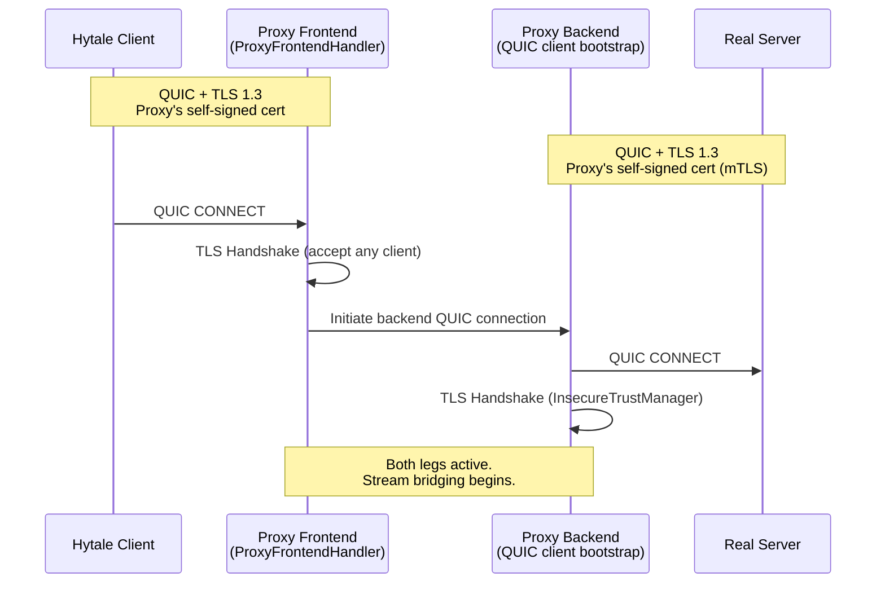
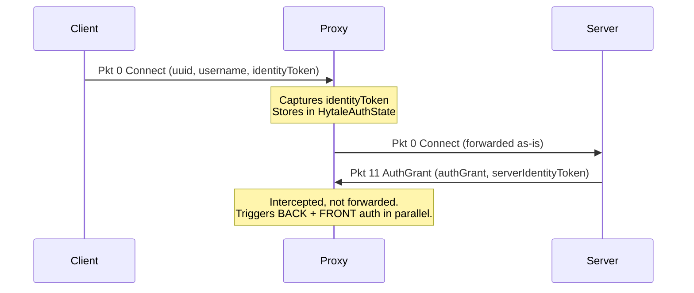
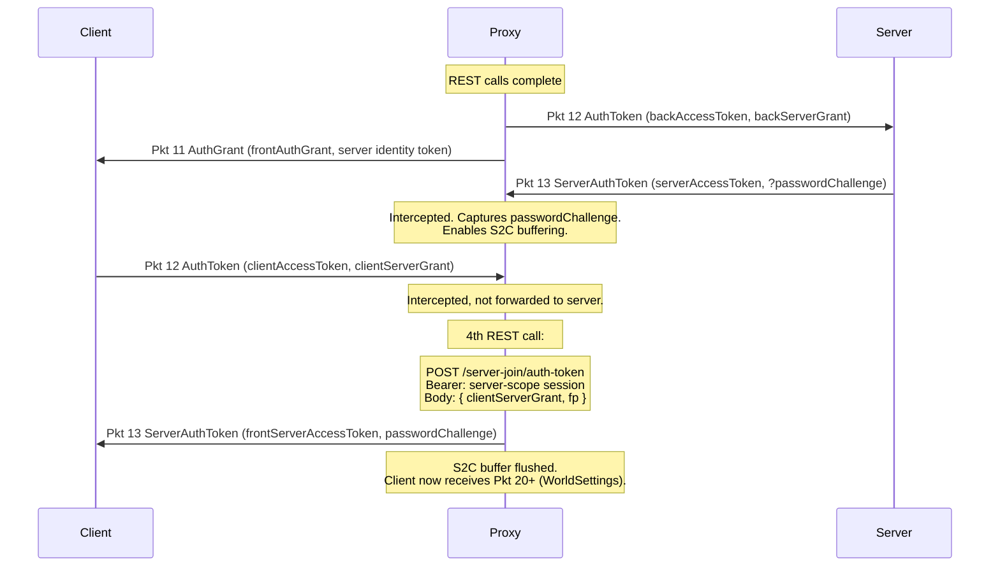

# Architecture

How the proxy is built and how a connection flows through it. For end-user setup
see [launch-modes.md](launch-modes.md); for writing plugins see [modules.md](modules.md).

## Overview

The proxy operates as two independent QUIC endpoints sharing a common authentication state:

```
┌──────────────┐          ┌───────────────────────────────────┐          ┌──────────────┐
│              │   QUIC   │            MITM Proxy             │   QUIC   │              │
│    Hytale    │◄────────►│                                   │◄────────►│    Hytale    │
│    Client    │  TLS 1.3 │  ┌─────────┐     ┌────────────┐   │  TLS 1.3 │    Server    │
│              │          │  │ Frontend│     │  Backend   │   │          │  (Dedicated) │
│              │          │  │ (Server)│◄───►│  (Client)  │   │          │              │
└──────────────┘          │  └─────────┘     └────────────┘   │          └──────────────┘
                          │        │               │          │
                          │        └───────┬───────┘          │
                          │          HytaleAuthState          │
                          │          (shared state)           │
                          └───────────────────────────────────┘
                                           │
                                    REST API calls
                                           │
                                           ▼
                                ┌──────────────────────┐
                                │  sessions.hytale.com │
                                │   /server-join/*     │
                                └──────────────────────┘
```

| Component | Role |
|---|---|
| **LauncherBridge** | Handles `_HytaleServer.jar` subprocess lifecycle and sync (Mode 1) |
| **ProxyConfig** | CLI/env resolution + runtime constants, run-mode detection |
| **QuicConfig** | Builds the QUIC server & client codecs |
| **ModuleManager** | Dynamic loading of external JAR modules |
| **Frontend (`ProxyServer` + `ProxyFrontendHandler`)** | Acts as a Hytale server to the client |
| **Backend (QUIC client bootstrap in `ProxyFrontendHandler`)** | Acts as a Hytale client to the real server |
| **HandlerRegistry** | Per-run instance (owned by `ModuleManager`) holding module packet-handler factories, keyed by `Direction` + `HandlerPosition` |

## Connection Topology



The proxy uses a **single self-signed certificate** (`SelfSignedCertificate("localhost")`) for both the frontend (as TLS server cert) and the backend (as mTLS client cert). The SHA-256 fingerprint of this certificate (`fp`) is used as the `x509Fingerprint` parameter in all REST calls to `sessions.hytale.com`.

## Token Model

The proxy needs three session tokens:

| Token | Scope | Purpose |
|-------|-------|---------|
| Client session | `hytale:client` | Bearer for **BACK** auth (proxy → real server) |
| Server session | `hytale:server` | Bearer for **FRONT** auth (proxy → client) |
| Server identity | `hytale:server` | JWT embedded in Pkt 11 sent to the client |

It never mints these itself (no `/oauth2/token` or `/game-session/new` calls) —
that would create a competing session and Hytale's one-session-per-account rule
would knock the running game offline. Instead it reuses the game's live player
session and derives the server-scope pair via `POST /game-session/child`. Where
the player session comes from depends on the run mode — see
[launch-modes.md](launch-modes.md).

## Authentication Flow

The client and server each expect to authenticate against `sessions.hytale.com`,
but the proxy sits in the middle and maintains **two independent token chains**:
one with the client ("front") and one with the real server ("back").

### Phase 1: Initial Handshake



### Phase 2: Token Exchange

When the proxy intercepts Pkt 11 from the real server, it runs the token exchange:

```
┌─────────── BACK (proxy → real server) ────────────┐
│  1. POST /server-join/auth-token                  │
│     Bearer: client-scope session                  │
│     Body: { authorizationGrant, x509Fingerprint }  │
│     → backAccessToken                              │
│  2. POST /server-join/auth-grant                   │
│     Bearer: client-scope session                   │
│     Body: { identityToken: serverIdentityToken }   │
│     → backServerGrant                              │
└────────────────────────────────────────────────────┘

┌─────────── FRONT (proxy → client) ────────────────┐
│  3. POST /server-join/auth-grant                   │
│     Bearer: server-scope session                   │
│     Body: { identityToken: clientIdentityToken }   │
│     → frontAuthGrant                               │
└────────────────────────────────────────────────────┘
```



### Phase 3: Session Stabilization

After Pkt 13 is delivered to the client, the proxy flushes all buffered
server-to-client packets (WorldSettings, asset definitions, JoinWorld, etc.). The
client transitions `WaitingForSetup → SettingUp → Playing` and normal bidirectional
forwarding begins.

### Re-Authentication (Token Rotation)

When the real server sends a **new Pkt 11** (periodic re-auth), the proxy repeats
the entire token exchange. The `HytaleAuthState` futures are overwritten so rotation
is supported:

```
Server sends new Pkt 11 → Proxy re-does BACK auth
                        → Proxy sends new Pkt 11 to client
Client sends new Pkt 12 → Proxy re-does FRONT token exchange
                        → Proxy sends new Pkt 13 to client
```

## Packet Protocol

### Framing

Every packet on every QUIC stream uses the same binary framing:

```
┌──────────────┬──────────────┬─────────────────────┐
│ payloadLen   │  packetId    │      payload        │
│ (4 bytes LE) │ (4 bytes LE) │  (payloadLen bytes) │
└──────────────┴──────────────┴─────────────────────┘
```

- All integers are **little-endian**.
- Multiple packets can be concatenated within a single QUIC STREAM frame.
- `PacketCodec` accumulates bytes into a `ByteBuf` and parses packets one at a time.
  Framing depends only on the 8-byte header, so it survives packet-schema drift.

### Key Packet IDs

| ID | Name | Direction | Proxy Action |
|----|------|-----------|--------------|
| 0 | `Connect` | C→S | Parse `identityToken`, capture in `HytaleAuthState`, forward |
| 3 | `Ping` | S→C | Forward (keep-alive) |
| 4 | `Pong` | C→S | Forward (keep-alive) |
| 11 | `AuthGrant` | S→C | **Intercept**. Trigger BACK + FRONT auth. Do NOT forward. |
| 12 | `AuthToken` | C→S | **Intercept**. Exchange client's server grant. Do NOT forward. |
| 13 | `ServerAuthToken` | S→C | **Intercept**. Capture `passwordChallenge`. Do NOT forward. |
| 15 | `PasswordResponse` | C→S | Forward with logging |
| 16 | `PasswordAccepted` | S→C | Forward with logging |
| 17 | `PasswordRejected` | S→C | Forward with logging |
| 20 | `WorldSettings` | S→C | Forward (buffered during auth) |
| 34 | `JoinWorld` | S→C | Forward |
| * | All others | Both | Forward transparently |

## QUIC Stream Management

Hytale uses multiple QUIC streams for different purposes:

| Stream ID | Type | Purpose |
|-----------|------|---------|
| 0 | Bidirectional | Main game channel (auth, world data, gameplay) |
| 3 | Unidirectional (S→C) | Chunk data |
| 4 | Bidirectional | Voice channel |
| 7 | Unidirectional (S→C) | World map data |

`ProxyFrontendHandler` implements a **stream reordering mechanism**. QUIC does not
guarantee stream creation order, but Hytale's protocol requires it:

```
Stream arrives at proxy:
  ├── streamId == nextExpected?  → Create matching stream on other side, link, update counter
  ├── streamId > nextExpected?   → Buffer until lower IDs arrive
  └── streamId < nextExpected?   → Link immediately (late arrival)
```

## S2C Buffering Mechanism

A critical synchronization mechanism prevents an auth-time race condition.

**Problem**: The real server sends `Pkt 13` (ServerAuthToken) and immediately follows
it with `Pkt 20` (WorldSettings). The proxy must intercept Pkt 13 and run an async
REST call to craft its own version. If Pkt 20 reaches the client before the proxy's
Pkt 13, the client enters an invalid state and times out after 30 seconds.

**Solution**:

```
┌──────────────────────────────────────────────────────────────────┐
│                    S2C Buffering Timeline                        │
├──────────────────────────────────────────────────────────────────┤
│  S2C receives Pkt 11  ──►  bufferingS2C = true                   │
│       │  S2C receives Pkt 13  ──►  captured, dropped             │
│       │  S2C receives Pkt 20  ──►  BUFFERED (not forwarded)      │
│       │  S2C receives Pkt 21+ ──►  BUFFERED                      │
│       │                                                          │
│  C2S handler finishes REST  ──►  Writes Pkt 13 to client         │
│       │                    ──►  buffering = false                │
│       │                    ──►  Fires FlushBufferingEvent        │
│       │                                                          │
│  S2C receives FlushBufferingEvent  ──►  Flushes buffered packets │
│       ▼                                                          │
│  Normal transparent forwarding resumes                           │
└──────────────────────────────────────────────────────────────────┘
```

`FlushBufferingEvent` is a custom Netty `UserEvent` fired from the C2S handler into
the S2C handler's pipeline — cross-handler coordination without shared mutable state.

## Pipeline Architecture

Each linked QUIC stream pair gets a 3-stage Netty pipeline per direction:

```
Raw bytes → [PacketCodec] → PacketFrame → [PacketRouter] → [PacketForwarder] → target
                                              │
                                ┌─────────────┴─────────────┐
                                │      PacketHandler[]      │
                                │  ├── ConnectObserver      │
                                │  ├── BackAuthHandler      │ (server-facing leg)
                                │  ├── FrontAuthHandler     │ (client-facing leg)
                                │  ├── RouteGuard           │ (S2C address rewrites)
                                │  ├── ServerAccessLogger   │ (Pkt 250/251/252 audit)
                                │  ├── PhaseTracker         │ (session lifecycle phase)
                                │  └── (plugin modules)     │ ← e.g. meridian-xray
                                └───────────────────────────┘
```

`PacketRouter` is **drift-tolerant**: if a packet fails to deserialize (unknown ID
or a schema change in a newer Hytale build) it logs a warning and forwards the
original raw frame unchanged — the stream is never corrupted.

| Class | Responsibility |
|-------|---------------|
| `ProxyServer` | Bootstraps QUIC server and client codecs. Run-mode dispatch. Initializes `HytaleAuthState`. |
| `ProxyFrontendHandler` | Manages the QUIC connection lifecycle. Bridges client streams to backend streams with ordering guarantees. Wires up the per-stream pipeline. |
| `PacketCodec` | Accumulates raw bytes, parses `[len\|id\|payload]` frames, emits `PacketFrame` objects. |
| `PacketRouter` | Iterates registered `PacketHandler`s for each frame. `FORWARD` → ships the original raw frame; `MODIFIED` → re-serialises the mutated `Packet` (Zstd-aware). |
| `PacketForwarder` | Writes framed packets to the target channel. Manages pending queue, target readiness polling, and S2C buffering. |
| `ProxySession` (api interface) / `ProxySessionImpl` (internal) | Per-stream-pair context shared between C2S and S2C handlers. Modules see the interface — `sendToClient()` / `sendToServer()`, `sendAndAwait()`, attachments; the impl adds channel wiring and auth state. |
| `PacketHandler` | Plugin interface. Returns `FORWARD` / `MODIFIED` / `DROP` / `HANDLED`. Receives `ProxySession` in every call. |
| `ConnectObserver` | Captures the client's `identityToken` and logs `referralSource` from Pkt 0. |
| `BackAuthHandler` | Intercepts Pkt 11 (S→C) and Pkt 12 (C→S) on the server-facing leg; performs BACK REST calls. |
| `FrontAuthHandler` | Intercepts Pkt 11/12/13 on the client-facing leg; performs the FRONT REST call, drives S2C buffering and `FlushBufferingEvent`. |
| `RouteGuard` | Drops Pkt 18 `ClientReferral` and clears `ServerInfo.fallbackServer` on Pkt 223. |
| `ServerAccessLogger` | Pass-through audit log for the singleplayer access protocol (Pkts 250/251/252); redacts passwords. |
| `PhaseTracker` | Advances `ProxySession.phase()` on lifecycle trigger packets so modules can gate by stage. |
| `HytaleAuthState` | Thread-safe container for token futures and certificate fingerprints. |
| `HytaleSessionApi` | Async HTTP client wrapping the `sessions.hytale.com/server-join/*` endpoints. |
| `GameProcessSnooper` | Reads `HYTALE_SESSION_TOKEN` from a running game process (standalone mode). |
| `LauncherSessionMinter` | Derives the server-scope token pair from a player session via `/game-session/child`. |

## QUIC Configuration

| Parameter | Value | Notes |
|-----------|-------|-------|
| `maxIdleTimeout` | 30,000 ms | Matches Hytale default |
| `initialMaxData` | 64 MB | Connection-level flow control |
| `initialMaxStreamData` | 16 MB | Per-stream flow control |
| `initialMaxStreamsBidi` | 128 | Bidirectional stream limit |
| `initialMaxStreamsUni` | 128 | Unidirectional stream limit |
| `congestionControl` | BBR | Bandwidth-optimized algorithm |
| `applicationProtocols` | `hytale/2`, `hytale/1` | ALPN negotiation |
| `SO_RCVBUF` / `SO_SNDBUF` | 8 MB / 4 MB | UDP socket buffers, set on both datagram channels |

The flow-control windows and UDP socket buffers are kept generous on purpose:
the Hytale setup payload (block-type catalog + assets) arrives as a multi-megabyte
burst. With OS-default UDP buffers the kernel drops datagrams whenever the event
loop hiccups, which QUIC sees as loss → retransmit storm → setup timeout.

## Project Structure

The repository is a **3-module Maven build** (Java 22, uber-jar via shade).
`meridian-core` — a Layer-1 module — lives in its own repository.

```
meridian-proxy/                          # git root — parent (aggregator) POM
├── pom.xml                              # packaging=pom; lists the three modules
│
├── meridian-api/                        # stable module SPI — meridian.api.*
│   └── module/   ProxyModule, ModuleContext, Scheduler, ModuleManifest
│       packet/   PacketHandler, PacketHandlerFactory, Direction, HandlerPosition, Packet
│       session/  ProxySession, SessionPhase, SessionInfo
│       event/    EventBus, EventPriority, ProxyEvent, PhaseChangedEvent, …
│       service/  ServiceRegistry
│       settings/ SettingsSpec, SettingNode
│
├── meridian-protocol/                   # decompiled Hytale packet model — meridian.protocol.*
│   └── io/             PacketIO (framing + Zstd), VarInt
│       packets/        AuthGrant, Connect, UpdateBlockTypes, …
│       PacketRegistry  ID ↔ Class, compression flag, max size
│
└── meridian-proxy/                      # the implementation — builds the runnable uber-jar
    └── src/main/java/meridian/internal/ # never exposed to modules
        ├── ProxyServer            # entry point, QUIC bootstrap, run-mode dispatch
        ├── ProxyFrontendHandler   # QUIC lifecycle, stream bridging, backend connect
        ├── HytaleAuthState        # shared token/fingerprint state
        ├── HytaleSessionApi       # async REST client for sessions.hytale.com
        ├── LogWindow              # Swing window + standalone connection bar
        ├── StandaloneState        # state.json — last host:port
        ├── auth/                  # GameProcessSnooper, LauncherSessionMinter
        ├── core/                  # ProxyConfig, QuicConfig, LauncherBridge,
        │                          #   PacketCodec/Router/Forwarder/Frame, ProxySessionImpl
        ├── module/                # ModuleManager, HandlerRegistry, ModuleContextImpl, SchedulerImpl
        ├── handler/               # built-in PacketHandlers
        ├── event/                 # EventBusImpl
        ├── service/               # ServiceRegistryImpl
        ├── settings/              # SettingsStore (per-module settings.json)
        └── gui/                   # SettingsRenderer (renders SettingsSpec to Swing)
```

`meridian-api` and `meridian-protocol` are published artifacts modules depend on
(`provided`); `meridian.internal.*` is implementation-private. Module authoring,
the `module.json` schema and the Layer-1 / Layer-2 split: [modules.md](modules.md).
